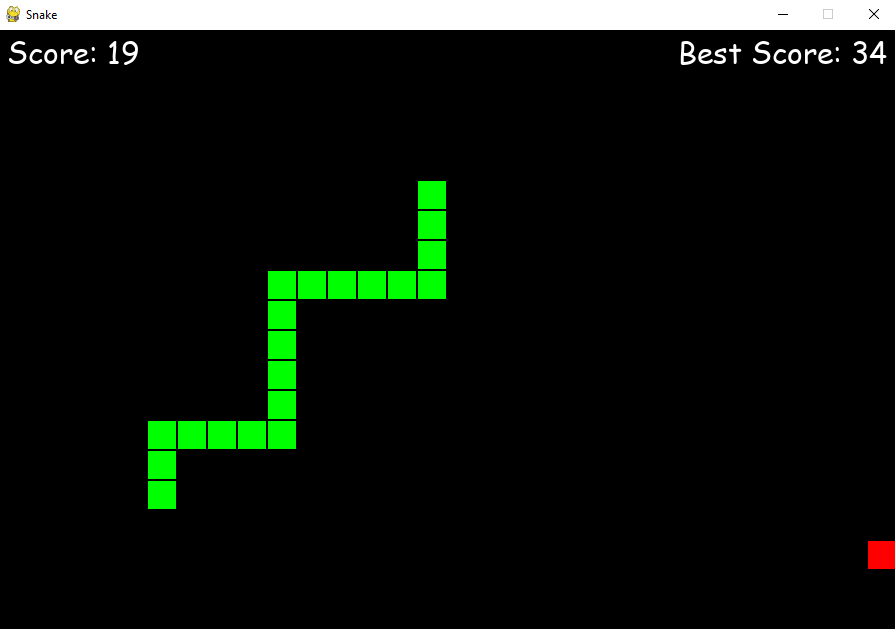

# Snake Game in Python

## Description

This project is a simple and fun implementation of the Snake game in Python.
The game was developed using the Pygame library, making it an excellent example for beginners in game programming.

## Author

Mathis Delsart

## Installation

Before you can play the Snake game, you need to install Pygame using pip:

```bash
pip install pygame
```

Once Pygame is installed, you can clone this repository:

```bash
git clone https://github.com/Mathis003/Snake-Game.git
```

## Usage

To start the Snake game, simply run the main.py file:

```bash
python main.py
```

To control the snake, use the arrow keys.

## Screenshots

<p align="center">
    
</p>